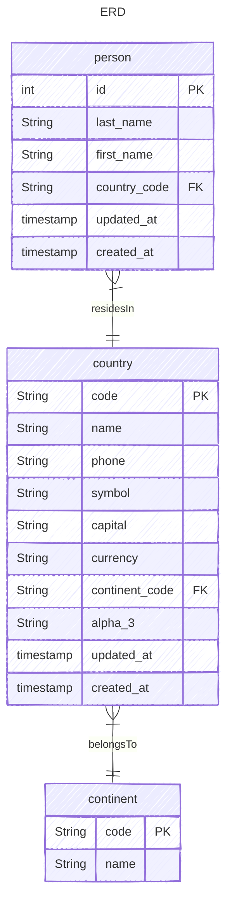

# GoGin

Sample API server built with Go and Gin framework.

## Technologies
- Go (1.25+)
- Gin (HTTP Framework)
- SQLite (Database)
- Goose (Migrations)
- Log/slog (Structured Logging)

## Architecture
The project follows a clean, layered architecture to separate concerns and ensure testability:
- **Controllers**: Handle HTTP requests, input binding, and validation.
- **Services**: Contain business logic and orchestrate operations between repositories.
- **Repositories**: Encapsulate data access logic and SQL queries.
- **Models**: Plain Go structs representing the domain entities.

## Prerequisites
- Go 1.25+ installed
- An SQLite database

## Quickstart

1. Clone the repository
2. Download dependencies: `go mod download`
3. Copy the example environment file and adjust settings:
   ```bash
   cp .env.example .env
   ```
4. Set up your database and run migrations
    ```bash
    go run cmd/migrate/main.go up
    ```
5. Start the server:
    ```bash
   go run cmd/server/main.go
   ```

## Building
To build the application, run:
```bash
go build -o main cmd/server/main.go
```

To build docker image, run:
```bash
docker build -f build/Dockerfile -t gogin .
``` 

## Testing

### Go tests
To run tests, use:
```bash
go test ./...
```

### JetBrains HTTP Client
The `test/http/` directory contains [JetBrains HTTP Client](https://www.jetbrains.com/help/idea/http-client-in-product-code-editor.html) files for manual API exploration:
- `test/http/api.http` — requests for all endpoints (continents, countries, persons)
- `test/http/http-client.env.json` — environment variables (`baseUrl`)

Open `api.http` in any JetBrains IDE and click the green play icon next to a request to execute it. 

## Project layout
- `cmd/` - application entry points
- `internal/` - internal packages
    - `app/` - application wiring and router setup
    - `config/` - configuration management
    - `controller/` - HTTP handlers
    - `service/` - business logic (Service/Usecase layer)
    - `repository/` - data access layer
    - `model/` - domain models
    - `lib/` - shared libraries (DB connection, migrations)
    - `util/` - utility functions
- `migrations/` - SQL migration files (goose format)
- `test/` - integration tests
    - `http/` - JetBrains HTTP Client files for manual API testing
- `AGENTS.md` - detailed agent-specific architecture and conventions guide

## Data Model


