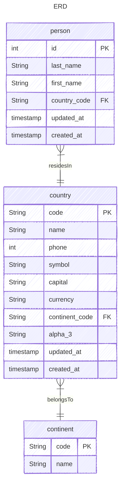

# GoGin

Sample API server built with Go and Gin framework.

## Technologies
- Go
- SQLite

## Prerequisites
- Go 1.25+ installed
- An SQLite database

## Quickstart

1. Clone the repository
2. Download dependencies: `go mod download`
3. Copy the example environment file and adjust settings:
   ```bash
   cp .env.example .env
   ```
4. Set up your database and run migrations
    ```bash
    docker run --rm -it --network=host -v "$(pwd):/db" -e DATABASE_URL=sqlite://gogin.db ghcr.io/amacneil/dbmate up
    ```
5. Start the server:
    ```bash
   go run cmd/server/main.go
   ```

## Building
To build the application, run:
```bash
go build -o remindify cmd/server/main.go
```

To build docker image, run:
```bash
docker build -f build/Dockerfile -t remindify-backend .
``` 

## Testing
To run tests, use:
```bash
go test ./...
``` 

## Project layout
- `go.mod` - Go modules
- `build/` - build scripts like `Dockerfile`
- `cmd/` - application entry points (e.g., `cmd/app/main.go`)
- `configs` - configuration files
- `internal/` - internal packages
- `migration/` - SQL migration files

## Data Model


