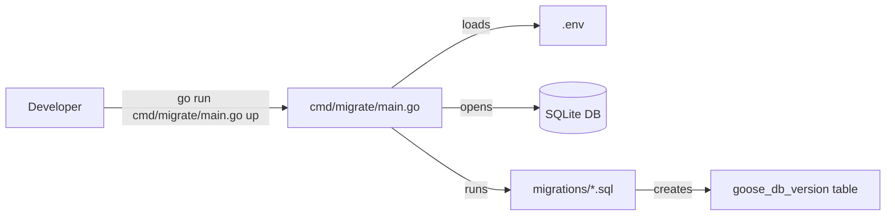

# Plan: Replace dbmate with a Go-native migration library

## Problem Statement

The project currently uses **dbmate** via Docker to run database migrations:

```bash
docker run --rm -it --network=host -v "$(pwd):/db" -e DATABASE_URL=sqlite:./db/gogin.db ghcr.io/amacneil/dbmate up
sudo chown $USER:$USER ./db/gogin.db
```

This is problematic because:
- Requires Docker to be installed and running
- Creates file-permission issues on the host (the SQLite file is owned by root)
- Adds an external dependency that is not tracked in `go.mod`
- Makes local development and CI setup more complex

## Recommended Library: `pressly/goose`

### Why goose?

| Criteria | goose | golang-migrate | rubenv/sql-migrate |
|---|---|---|---|
| Pure Go / no Docker | Yes | Yes | Yes |
| SQLite support (incl. modernc.org/sqlite) | Yes | Yes | Yes |
| Single-file `up`/`down` SQL migrations | Yes | No (separate files) | No |
| CLI + programmatic API | Yes | Yes | Go API only |
| Active maintenance / popularity | Very high | Very high | Moderate |
| Syntax similarity to dbmate | Very close (`-- +goose Up`) | Different | Different |

**golang-migrate/migrate** is the only other serious contender, but it requires splitting each migration into two files (`.up.sql` and `.down.sql`). Since the existing setup uses single files with `-- migrate:up` and `-- migrate:down` sections, **goose** is the closest drop-in replacement.

### Syntax Mapping

The required change to existing migration files is minimal:

| dbmate | goose |
|---|---|
| `-- migrate:up` | `-- +goose Up` |
| `-- migrate:down` | `-- +goose Down` |

Example:

```sql
-- +goose Up
CREATE TABLE continent (
    code TEXT NOT NULL PRIMARY KEY,
    name TEXT NOT NULL
);

-- +goose Down
DROP TABLE IF EXISTS continent;
```

## Proposed Architecture



## Implementation Steps

1. **Add dependency**  
   Add `github.com/pressly/goose/v3` to `go.mod`.

2. **Reformat existing migrations**  
   Update the two files in `migrations/` to use goose comment syntax (`-- +goose Up` / `-- +goose Down`).

3. **Create `cmd/migrate/main.go`**  
   A small CLI wrapper that:
   - Loads config from `.env` using the existing `internal/config` package
   - Opens the SQLite connection via `modernc.org/sqlite`
   - Delegates to `goose.RunContext` for `up`, `down`, `status`, `version`, etc.

4. **Update documentation**  
   Replace the Docker/dbmate instructions in `README.md` with:
   ```bash
   go run cmd/migrate/main.go up
   ```

5. **Clean up**  
   Remove dbmate-specific references from `README.md`.

## Usage After Migration

```bash
# Run all pending migrations
go run cmd/migrate/main.go up

# Check migration status
go run cmd/migrate/main.go status

# Rollback last migration
go run cmd/migrate/main.go down

# Create a new migration file
go run cmd/migrate/main.go create seed_more_data sql
```

## Migration File Convention

Keep the existing timestamped naming convention:
```
migrations/
├── 20260115134728_create_schema.sql
└── 20260115134736_seed_data.sql
```

This is fully compatible with goose.

## Risks & Mitigations

| Risk | Mitigation |
|---|---|
| `modernc.org/sqlite` driver name differs from `sqlite3` | Use `sql.Open("sqlite", ...)` and `goose.SetDialect("sqlite3")` (dialect SQL is standard) |
| Existing DB already has dbmate schema | goose will create its own `goose_db_version` table. For a fresh dev DB this is fine. If preserving data is needed, we can document a one-time reset. |
| Team familiarity with goose | goose is widely used in Go; docs are at [github.com/pressly/goose](https://github.com/pressly/goose) |
